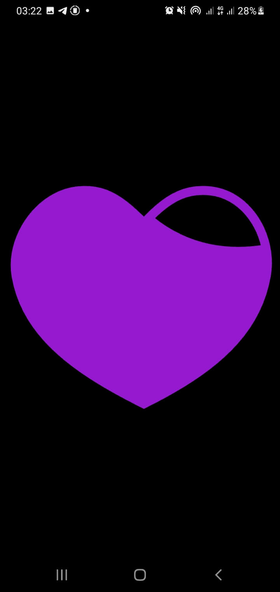
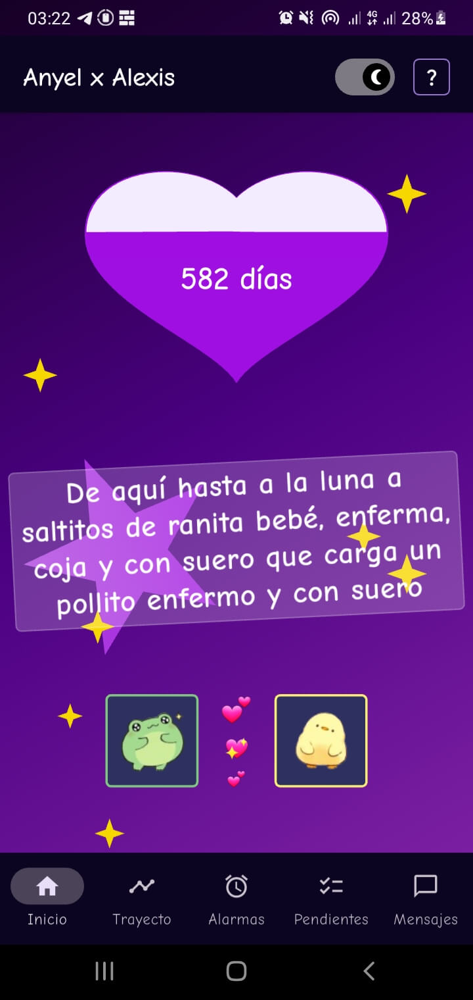
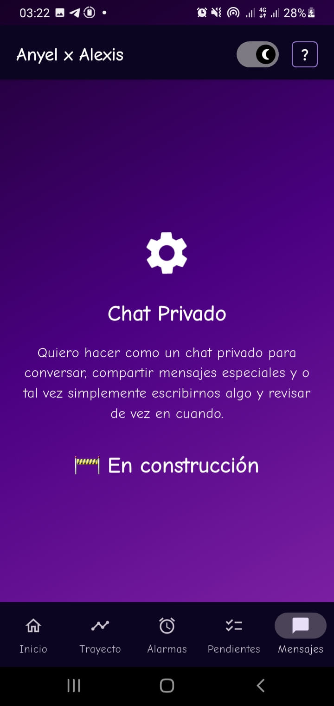

# Flutter Love App
**Flutter Love App** es una aplicación móvil personalizada desarrollada por **Alexis Manuel Hurtado Garcia** como regalo de San Valentín. La aplicación está diseñada para expresar amor y aprecio de una manera única e interactiva, contando los días transcurridos desde una fecha especial (27 de enero de 2024) y ofreciendo una experiencia visual encantadora con animaciones fluidas y un diseño hermoso.

## Tech Stack
<div style="display: flex; align-items: center;">
  
  
</div>

## Características
- **Pantalla de Inicio Animada**: Una pantalla de bienvenida con animaciones Lottie fluidas y atractivas.
- **Contador de Días**: Muestra los días transcurridos desde una fecha específica (27/01/2024) con actualización automática.
- **Diseño Personalizado**: Interfaz con forma de corazón y estética visual romántica con gradientes hermosos.
- **Tema Claro/Oscuro**: Soporte para modo claro y oscuro con transiciones suaves.
- **Animaciones Interactivas**: Animaciones con gotas de agua y efectos visuales encantadores.
- **Personajes Adorables**: Incluye una ranita y un patito como elementos decorativos personalizados.

## Dependencias
### Dependencias Principales
- `animated_splash_screen`: Para crear una pantalla de inicio atractiva y animada.
- `flutter_native_splash`: Para agregar una pantalla de inicio nativa personalizada.
- `flutter_launcher_icons`: Para configurar y generar iconos personalizados de la aplicación.
- `lottie`: Para reproducir animaciones avanzadas y fluidas.
- `google_fonts`: Para utilizar fuentes personalizadas (Comic Neue) en toda la aplicación.

### Dependencias de Desarrollo
- `flutter_lints`: Para mantener la calidad del código con reglas de estilo.

## Cómo usar
   Clona este repositorio:
   ```bash
   git clone https://github.com/A4GOD-AMHG/Flutter-LoveApp.git
   cd Flutter-LoveApp
   flutter pub get
   flutter run
   ```
   Construir el proyecto:
   ```bash
   flutter build apk --split-per-abi
   ```

## Estructura del Proyecto
```
lib/
├── main.dart                 # Punto de entrada de la aplicación
├── screens/                  # Pantallas principales
├── widgets/                  # Componentes reutilizables
│   ├── splash_screen.dart    # Pantalla de inicio animada
│   ├── layout_widget.dart    # Layout principal
│   ├── date_counter.dart     # Contador de días
│   └── love_animals.dart     # Personajes adorables
└── utils/                    # Utilidades y herramientas
    ├── theme_controller.dart # Control de temas
    └── clippers.dart         # Formas personalizadas

assets/
├── frog.png                  # Imagen de la ranita
├── duck.png                  # Imagen del patito
├── *.json                    # Animaciones Lottie
└── google_fonts/             # Fuentes personalizadas
```

## Capturas de Pantalla
<div align="center" style="display: flex; gap: 10px; flex-wrap: wrap; margin: 10px 0;">
  
  
  
</div>

## Licencia
Este proyecto es una aplicación personal desarrollada con fines románticos y educativos.

## Autor
**Alexis Manuel Hurtado Garcia** - [GitHub](https://github.com/A4GOD-AMHG)